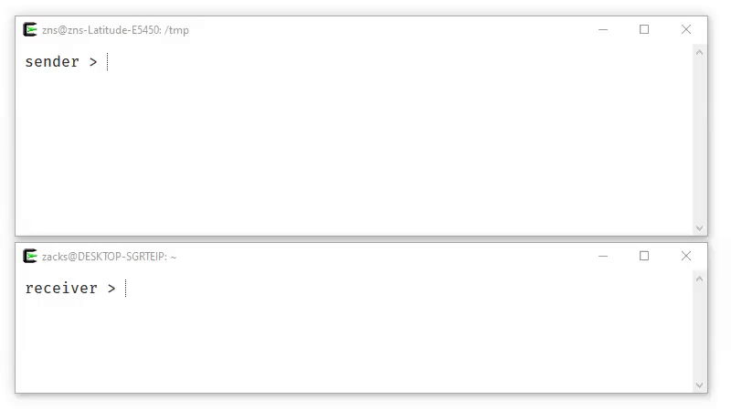

<p align="center">

<br>
<a href="https://github.com/schollz/croc/releases/latest"></a>
<a href="https://coveralls.io/github/schollz/croc"></a>
<a href="https://travis-ci.org/schollz/croc"></a> 
</p>

`croc` is a tool that allows any two computers to simply and securely transfer files and folders. AFAIK, *croc* is the only CLI file-transfer tool does **all** of the following:

- allows **any two computers** to transfer data (using a relay)
- provides **end-to-end encryption** (using PAKE)
- enables easy **cross-platform** transfers (Windows, Linux, Mac)
- allows **multiple file** transfers
- allows **resuming transfers** that are interrupted
- local server or port-forwarding **not needed**
- **ipv6-first** with ipv4 fallback

For more information about `croc`, see [my blog post](https://schollz.com/software/croc6).



## Install

Download [the latest release for your system](https://github.com/schollz/croc/releases/latest), or install a release from the command-line:

```
$ curl https://getcroc.schollz.com | bash
```


On macOS you can install the latest release with [Homebrew](https://brew.sh/): 

```
$ brew install schollz/tap/croc
```

On macOS you can also install the latest release with [MacPorts](https://macports.org/): 

```
$ sudo port selfupdate
$ sudo port install croc
```

On Windows you can install the latest release with [Scoop](https://scoop.sh/): 

```
$ scoop install croc
```

On Unix you can install the latest release with [Nix](https://nixos.org/nix):

```
$ nix-env -i croc
```


On Arch Linux you can install the latest release with `pacman`:

```
$ pacman -S croc
```

On Ubuntu you can install with `snap`:

```
$ snap install croc
```

On Termux you can install with `pkg`:

```
$ pkg install croc
```

Or, you can [install Go](https://golang.org/dl/) and build from source (requires Go 1.12+): 

```
$ GO111MODULE=on go get -v github.com/schollz/croc/v8
```


## Usage 

To send a file, simply do: 

```
$ croc send [file(s)-or-folder]
Sending 'file-or-folder' (X MB)
Code is: code-phrase
```

Then to receive the file (or folder) on another computer, you can just do 

```
$ croc code-phrase
```

The code phrase is used to establish password-authenticated key agreement ([PAKE](https://en.wikipedia.org/wiki/Password-authenticated_key_agreement)) which generates a secret key for the sender and recipient to use for end-to-end encryption.

There are a number of configurable options (see `--help`). A set of options (like custom relay, ports, and code phrase) can be set using `--remember`.

### Custom code phrase

You can send with your own code phrase (must be more than 4 characters).

```
$ croc send --code [code-phrase] [file(s)-or-folder]
```

### Use pipes - stdin and stdout

You can pipe to `croc`:

```
$ cat [filename] | croc send
```

In this case `croc` will automatically use the stdin data and send and assign a filename like "croc-stdin-123456789". To receive to `stdout` at you can always just use the `--yes`  will automatically approve the transfer and pipe it out to `stdout`. 

```
$ croc --yes [code-phrase] > out
```

All of the other text printed to the console is going to `stderr` so it will not interfere with the message going to `stdout`.


### Send text 

Sometimes you want to send URLs or short text. In addition to piping, you can easily send text with `croc`:

```
$ croc send --text "hello world"
```

This will automatically tell the receiver to use `stdout` when they receive the text so it will be displayed.

### Self-host relay

The relay is needed to staple the parallel incoming and outgoing connections. By default, `croc` uses a public relay but you can also run your own relay:

```
$ croc relay
```

By default it uses TCP ports 9009-9013. Make sure to open those up. You can customized the ports (e.g. `croc relay --ports 1111,1112`), but you must have a minimum of **2** ports for the relay. The first port is for communication and the subsequent ports are used for the multiplexed data transfer.

You can send files using your relay by entering `--relay` to change the relay that you are using if you want to custom host your own.

```
$ croc --relay "myrelay.example.com:9009" send [filename]
```

Note, when sending, you only need to include the first port (the communication port). The subsequent ports for data transfer will be transmitted back to the user from the relay.

#### Self-host relay (docker)

If it's easier you can also run a relay with Docker:


```
$ docker run -d -p 9009-9013:9009-9013 -e CROC_PASS='YOURPASSWORD' schollz/croc
```

Be sure to include the password for the relay otherwise any requests will be rejected. 

```
$ croc --pass YOURPASSWORD --relay "myreal.example.com:9009" send [filename]
```

Note: when including `--pass YOURPASSWORD` you can instead pass a file with the password, e.g. `--pass FILEWITHPASSWORD`.

## License

MIT

## Acknowledgements

`croc` has gone through many iterations, and I am awed by all the great contributions! If you feel like contributing, in any way, by all means you can send an Issue, a PR, ask a question, or tweet me ([@yakczar](http://ctt.ec/Rq054)).

Thanks [@warner](https://github.com/warner) for the [idea](https://github.com/warner/magic-wormhole), [@tscholl2](https://github.com/tscholl2) for the [encryption gists](https://gist.github.com/tscholl2/dc7dc15dc132ea70a98e8542fefffa28), [@skorokithakis](https://github.com/skorokithakis) for [code on proxying two connections](https://www.stavros.io/posts/proxying-two-connections-go/). Finally thanks for making pull requests [@maximbaz](https://github.com/maximbaz), [@meyermarcel](https://github.com/meyermarcel), [@Girbons](https://github.com/Girbons), [@techtide](https://github.com/techtide), [@heymatthew](https://github.com/heymatthew), [@Lunsford94](https://github.com/Lunsford94), [@lummie](https://github.com/lummie), [@jesuiscamille](https://github.com/jesuiscamille), [@threefjord](https://github.com/threefjord), [@marcossegovia](https://github.com/marcossegovia), [@csleong98](https://github.com/csleong98), [@afotescu](https://github.com/afotescu), [@callmefever](https://github.com/callmefever), [@El-JojA](https://github.com/El-JojA), [@anatolyyyyyy](https://github.com/anatolyyyyyy), [@goggle](https://github.com/goggle), [@smileboywtu](https://github.com/smileboywtu), [@nicolashardy](https://github.com/nicolashardy), [@fbartels](https://github.com/fbartels), [@rkuprov](https://github.com/rkuprov), [@xenrox](https://github.com/xenrox) and [Ipar](https://github.com/lpar)!
