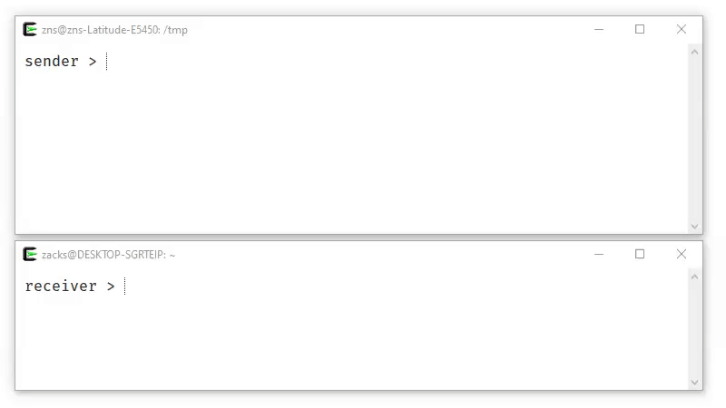

<p align="center">
  <a href="https://getcroc.com"></a>
  <br>
  <a href="https://github.com/schollz/croc/releases/latest"></a>
  <a href="https://github.com/schollz/croc/actions/workflows/ci.yml"></a>
  <a href="https://github.com/sponsors/schollz"></a>
</p>
<p align="center">
  <strong>This project’s future depends on community support. <a href="https://github.com/sponsors/schollz">Become a sponsor today</a>.</strong>
</p>

<p align="center">
Supporting organizations:
</p>
<p align="center">
<a href="https://sx.org/c/CROC">

</a>
</p>


## About

`croc` is a tool that allows any two computers to simply and securely transfer files and folders. AFAIK, _croc_ is the only CLI file-transfer tool that does **all** of the following:

- Allows **any two computers** to transfer data (p2p with relay fallback)
- Provides **end-to-end encryption** (using PAKE)
- Enables easy **cross-platform** transfers (Windows, Linux, Mac, [Browser](https://getcroc.com))
- Allows **multiple file** transfers
- Allows **resuming transfers** that are interrupted
- No need for local server or port-forwarding
- **IPv6-first** with IPv4 fallback
- Can **use a proxy**, like Tor

For more information about `croc`, see [my blog post](https://schollz.com/tinker/croc6/) or read a [recent interview I did](https://console.substack.com/p/console-91).



## No-install

You can use croc without installing anything at [getcroc.com](https://getcroc.com).

The browser version is fully compatible with the CLI, so you can send and receive files between them.

## Install

You can download [the latest release for your system](https://github.com/schollz/croc/releases/latest), or install a release from the command-line:

```bash
curl https://getcroc.com | bash
```

When the CLI sends or receives a transfer, it checks for a newer croc release at
most once every 24 hours. The check runs in the background and any update notice
is shown after the transfer finishes. Network and release-service failures are
ignored; `--quiet` suppresses the notice.

### On macOS

Using [Homebrew](https://brew.sh/):

```bash
brew install croc
```

Using [MacPorts](https://www.macports.org/):

```bash
sudo port selfupdate
sudo port install croc
```

### On Windows

You can install the latest release with [Scoop](https://scoop.sh/) or
[Chocolatey](https://chocolatey.org/):

```bash
scoop install croc
```

```bash
choco install croc
```

### Using nix-env

You can install the latest release with [Nix](https://nixos.org/):

```bash
nix-env -i croc
```

### On NixOS

You can add this to your [configuration.nix](https://nixos.org/manual/nixos/stable/#ch-configuration):

```nix
environment.systemPackages = [
  pkgs.croc
];
```

### On Alpine Linux

First, install dependencies:

```bash
apk add bash coreutils
wget -qO- https://getcroc.com | bash
```

### On Debian

Install from the pkg.haus APT archive:

```bash
# Add the repository (see https://pkg.haus for setup instructions)
sudo apt install croc
```

### On Arch Linux

Install with `pacman`:

```bash
pacman -S croc
```

### On Termux

Install with `pkg`:

```bash
pkg install croc
```

### On FreeBSD

Install with `pkg`:

```bash
pkg install croc
```

### On Linux, macOS, and Windows via Conda

You can install from [conda-forge](https://github.com/conda-forge/croc-feedstock) globally with [`pixi`](https://pixi.sh/):

```bash
pixi global install croc
```

Or install into a particular environment with [`conda`](https://docs.conda.io/projects/conda/):

```bash
conda install --channel conda-forge croc
```

### On Linux, macOS via Docker

Add the following one-liner function to your ~/.profile (works with any POSIX-compliant shell):

```bash
croc() { [ $# -eq 0 ] && set -- ""; mkdir -p "$HOME/.config/croc"; docker run --rm -it --user "$(id -u):$(id -g)" -v "$(pwd):/c" -v "$HOME/.config/croc:/.config/croc" -w /c -e CROC_SECRET docker.io/schollz/croc "$@"; }
```

You can also just paste it in the terminal for current session. On first run Docker will pull the image. `croc` via Docker will only work within the current directory and its subdirectories.

### Build from Source

If you prefer, you can [install Go](https://go.dev/dl/) and build from source (requires Go 1.27+):

```bash
go install github.com/schollz/croc/v11@latest
```

### On Android

There are F-Droid apps available:

- [crocgui](https://f-droid.org/packages/com.github.howeyc.crocgui/) — original port (Go, basic UI)
- [croc-app](https://f-droid.org/en/packages/com.dking.crocapp/) — native Kotlin/Jetpack Compose client with a modern, mobile-first interface
- [FlCroc](https://github.com/576576/FlCroc) — cross-platform Flutter GUI (Android, Windows, Linux) that wraps the `croc` binary as its transfer core.

### On Desktop

Community made desktop apps:

- [Croc GUI](https://github.com/interfluve-wav/croc-gui) — unofficial desktop GUI for macOS, Windows, and Linux that bundles the `croc` binary for drag-and-drop transfers, QR codes, LAN mode, and relay/proxy options.
- [croc-desktop](https://github.com/SihanTeng/croc-desktop) — unofficial desktop GUI for Linux, macOS, and Windows (experimental iOS/Android) built with Wails v3; embeds croc in-process for send/receive, QR codes, history, logs, and optional relay hosting.
- [Swamp Swap](https://github.com/Ferase/SwampSwap) — unofficial PyQt6 GUI desktop app for macOS, Windows, and Linux, requires installing `croc` on its own normally in order to use. Made to be compact and simple.

## Usage

To send a file, simply do:

```bash
$ croc send [file(s)-or-folder]
Sending 'file-or-folder' (X MB)
Code is: code-phrase
```

Then, to receive the file (or folder) on another computer, run:

```bash
croc code-phrase
```

The code phrase is used to establish password-authenticated key agreement ([PAKE](https://en.wikipedia.org/wiki/Password-authenticated_key_agreement)) which generates a secret key for the sender and recipient to use for end-to-end encryption.

### Share a terminal with `croc ssh`

On Linux, macOS, FreeBSD, or OpenBSD, start a shared terminal with:

```bash
croc ssh
```

The host receives separate six-word invitations for read/write and read-only
participants. On Unix, a participant keeps the invitation out of the process
list by joining with the command croc prints:

```bash
CROC_SECRET='six-word-invitation' croc ssh
```

Everyone sees one persistent terminal. Multiple read/write participants may
type; read-only participants receive the same output but their input is
discarded. 

This does not expose an SSH daemon or require an account, public IP, inbound
port, or SSH key setup. The invitation authenticates an ephemeral Tailcat
WireGuard path and pins an ephemeral SSH host key. Tailcat uses DERP when it
cannot establish a direct path; if Tailcat itself is unavailable, the client
reauthenticates and carries the pinned SSH stream over the ordinary croc relay.
Remote commands, forwarding, and SFTP are disabled. Anyone who receives an
invitation has the role printed beside it until the host stops, so treat both
invitations as secrets. 

See the
[SSH sharing design and security guide](src/docs/SSH_SHARING.md) for protocol,
reconnection, platform, relay, and threat-model details.

### Customizations & Options

#### Encrypted temporary storage

When an immediate peer-to-peer transfer is inconvenient, `croc` can upload
regular files as client-side encrypted ciphertext:

```bash
croc send --store [file1] [file2]
croc send --store --store-downloads 3 [file1] [file2]
croc send --store --store-expiration 3d [file1] [file2]
```

The command prints a browser link and a CLI token. The transfer expires after
the selected lifetime, measured from successful upload completion, or after
its configured number of receivers download, authenticate, and verify every
file—whichever happens first. The lifetime defaults to one day and accepts
whole minutes (`m`), hours (`h`), days (`d`), or weeks (`w`). The download
limit defaults to one. Both values are subject to server policy. Run `croc`
with no arguments and paste the token at the prompt to receive it. For
automation, keep the token out of the process list:

```bash
CROC_STORE_TOKEN='croc-store-v1....' croc --out ./downloads
```

The browser link has the form
`https://host/s/id#v1.decryption-key`. The decryption key is after `#` because
URL fragments are not included in HTTP requests, so the storage service gets
the opaque transfer ID but not the key. The full link is still a secret: anyone
who has it can decrypt the files and claim one of the allowed downloads.

While a transfer remains available, its sender can delete it with the locally
saved revoke receipt:

```bash
croc --revoke [transfer-id]
```

Stored mode is opt-in and separate from croc's normal live relay transfers. A
self-hosted service can be selected with `--store-url` or `CROC_STORE_URL`.
See [the stored-transfer design and operator guide](src/docs/STORED_TRANSFERS.md)
for protocol, privacy, limits, and deployment details.

#### Using `croc` on Linux or macOS

On Linux and macOS, the sending and receiving process is slightly different to avoid [leaking the secret via the process name](https://nvd.nist.gov/vuln/detail/CVE-2023-43621). You will need to run `croc` with the secret as an environment variable. For example, to receive with the secret `***`:

```bash
CROC_SECRET=*** croc
```

For single-user systems, the default behavior can be permanently enabled by running:

```bash
croc --classic
```

#### Custom Code Phrase

You can send with your own code phrase (must be at least 6 characters):

```bash
croc send --code [code-phrase] [file(s)-or-folder]
```

For default public transfers, SHA-256 of the exact code modulo the ordered
three-relay pool determines which deployment both peers use. An automatically
generated sender probes all three relays and generates a normal EFF code that
maps to the first healthy one to respond. A custom code maps directly without probing
or fallback. `--relay`, `CROC_RELAY`, `--ip`, and local-only transfers bypass
this public routing rule. The generated sender caches the winning address in
`best-relay` alongside croc's other configuration files, then reuses it without
probing. A relay connection failure removes the cache so the following send
measures the pool again; deleting the file also forces a new measurement.

#### Allow Overwriting Without Prompt

To automatically overwrite files without prompting, use the `--overwrite` flag:

```bash
croc --yes --overwrite <code>
```

#### Keep Both Files Without Prompt

To keep an existing file and receive the incoming one under a new name (e.g. `video (1).mkv`), use the `--rename` flag:

```bash
croc --yes --rename <code>
```

#### Excluding Folders

To exclude folders from being sent, use the `--exclude` flag with comma-delimited exclusions. This does a case-insensitive **substring** match against each file's relative path, so any path containing one of the given strings anywhere is excluded:

```bash
croc send --exclude "node_modules,.venv" [folder]
```

If you need to exclude one specific file rather than every path containing a substring (for example, two files share a name at different depths and only one should be excluded), use `--exclude-file` instead. It takes comma-delimited relative paths and matches them **exactly**:

```bash
croc send --exclude-file "subfolder/image.jpg" [folder]
```

#### Use Pipes - stdin and stdout

You can pipe to `croc`:

```bash
cat [filename] | croc send
```

To receive the file to `stdout`, you can use:

```bash
croc --yes [code-phrase] > out
```

#### Send Text

To send URLs or short text, use:

```bash
croc send --text "hello world"
```

#### Send Multiple Files

You can send multiple files directly by listing the files and/or folders:

```bash
croc send [file1] [file2] [file3] [folder1] [folder2]
```

#### Show QR Code

To show QR code (for mobile devices), use:

```bash
croc send --qr [file(s)-or-folder]
```

The QR code opens `https://getcroc.com/?code=...`, where the web client
automatically connects in receive-only mode.

#### Use a Proxy

You can send files via a proxy by adding `--socks5`:

```bash
croc --socks5 "127.0.0.1:9050" send SOMEFILE
```

<p align="center">
  <strong>Sponsored by <a href="https://sx.org/en/proxy/">SX.org</a>.</strong>
</p>

### Data transport selection

The native CLI defaults to `--transport auto`. After the normal three-word-code
PAKE handshake, two compatible native clients create PAKE-bound Tailcat node
identities and open one or more TCP streams over an in-process Tailscale
userspace WireGuard network. Magicsock starts through DERP and promotes the
connection to a direct UDP path whenever NAT traversal succeeds. If the peer is
a browser, an older client, or Tailcat setup fails, both clients use croc's
existing relay data ports. The public spelling `--transport derp` is retained;
in strict mode it requires Tailcat support and disables croc-relay fallback.
Public DERP is best effort and may apply fairness limits; see Tailscale's
[DERP reference](https://tailscale.com/docs/reference/derp-servers) and
[performance guidance](https://tailscale.com/docs/reference/troubleshooting/poor-performance-tailnet).


#### Change Encryption Curve

To choose a different elliptic curve for encryption, use the `--curve` flag:

```bash
croc --curve p521 <codephrase>
```

#### Change Hash Algorithm

For faster hashing, use the `imohash` algorithm:

```bash
croc send --hash imohash SOMEFILE
```

#### Clipboard Options

By default, the code phrase is copied to your clipboard. To disable this:

```bash
croc --disable-clipboard send [filename]
```

To copy the full command with the secret as an environment variable (useful on Linux/macOS):

```bash
croc --extended-clipboard send [filename]
```

This copies the full command like `CROC_SECRET="code-phrase" croc` (including any relay/pass flags).

#### Quiet Mode

To suppress all output (useful for scripts and automation):

```bash
croc --quiet send [filename]
```

#### Self-host Relay

You can run your own relay:

```bash
croc relay
```

By default, it uses TCP ports 9009-9013. You can customize the ports (e.g., `croc relay --ports 1111,1112`), but at least **2** ports are required.

To send files using your relay:

```bash
croc --relay "myrelay.example.com:9009" send [filename]
```

#### Self-host Relay with Docker

You can also run a relay with Docker:

```bash
docker run -d -p 9009-9013:9009-9013 -e CROC_PASS='YOURPASSWORD' docker.io/schollz/croc
```

To send files using your custom relay:

```bash
croc --pass YOURPASSWORD --relay "myreal.example.com:9009" send [filename]
```

To use custom ports, set `CROC_PORTS` (comma-separated) or `CROC_PORT` (base port):

```bash
docker run -d -p 9010-9011:9010-9011 -e CROC_PORTS='9010,9011' -e CROC_PASS='YOURPASSWORD' docker.io/schollz/croc
```

#### Web client

The React/Vite client in [`web/`](web/) can send and receive multiple files and
join `croc ssh` sessions hosted by normal CLI peers. The production client and its WebAssembly protocol
runtime are bundled only in the standalone `croc-web` server, keeping generated
assets and web-server code out of the cross-platform `croc` binary. Linux
amd64 builds of `croc-web` are published separately with each release. It
serves both the site and its same-origin WebSocket relay:

```bash
croc-web getcroc.com
```

This binds to `127.0.0.1:9014` by default for an HTTPS reverse proxy. `/`
serves the website and `/ws` bridges to the code-selected public relay at
`1.getcroc.com`, `2.getcroc.com`, `3.getcroc.com`, or `4.getcroc.com`. For a directly
accessible local development server, `croc-web localhost:5173` binds and
serves on `localhost:5173`. Use `--bind`, `--relays`, and `--ports` before the
website address to customize the local listener or upstream croc relay.

Run `make build-web` to generate the ignored production assets and build a
local server. See [`web/README.md`](web/README.md) for frontend development,
custom relay, and reverse-proxy instructions.

## Deployment

### Disco

[Disco](https://disco.cloud/) is used to deploy. The root [`Dockerfile`](Dockerfile) and [`disco.json`](disco.json) deploy the
`croc-web` web client and `croc` TCP relay as two Disco services built from the
same image.
Disco serves the website over HTTPS, while relay ports 9009-9017 are published
directly as TCP ports.

Set the deployment environment variables with:

```bash
disco env:set \
  SITE_URL=yoururl.com \
  CROC_RELAY_PORTS=9009,9010,9011,9012,9013,9014,9015,9016,9017 \
  CROC_PASS=yourpass \
  --project croc
```

`SITE_URL` must be the public website hostname without `https://`. Change the
project name if it is not `croc`. The `web` service mounts the named
`croc-store` volume at `/www/croc/storage`, which is also its configured
`--store-dir`, so stored ciphertext and metadata survive container replacement
and redeployment. The `web` service also reserves published TCP port 9020 and
maps it to unused container port 65535. This deliberate port collision makes
Disco stop the previous volume-owning web service before starting its
replacement, avoiding concurrent access to the store. Port 9020 carries no
application traffic and should remain blocked by the server firewall.

The ports in `CROC_RELAY_PORTS` must match the `publishedPorts` entries in
the `relay` service in [`disco.json`](disco.json); do not include the web
service's deployment-only port 9020. Disco cannot generate host port mappings
from an environment variable. Make sure the relay TCP ports are also open in
the server's firewall or cloud security group.

## Acknowledgements

`croc` has evolved through many iterations, and I am thankful for the contributions! Special thanks to:

- [@warner](https://github.com/warner) for the [idea](https://github.com/magic-wormhole/magic-wormhole)
- [@tscholl2](https://github.com/tscholl2) for the [encryption gists](https://gist.github.com/tscholl2/dc7dc15dc132ea70a98e8542fefffa28)
- [@skorokithakis](https://github.com/skorokithakis) for [proxying two connections](https://www.stavros.io/posts/proxying-two-connections-go/)

And many more!
