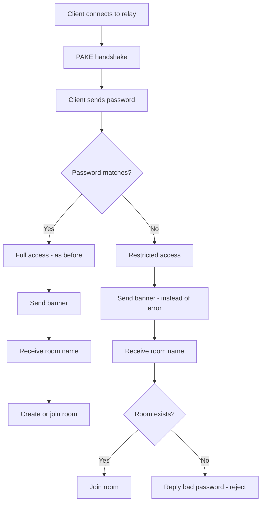

# Plan: Two-level relay authorization in croc

## Problem

When sender CS1 runs relay CR with password CRP and sends a file to recipient CR1, the receive command includes `--pass CRP`. Recipient CR1 learns the relay password and can:
- Create new rooms on the relay
- Send files to others through the relay without CS1's permission

## Solution: Modify ONLY the relay

**The client side does NOT change.** All logic is on the relay side.



### Backward compatibility

| Scenario | Client password | Relay password | Behavior |
|----------|----------------|----------------|----------|
| Public relay | pass123 | pass123 | ✅ Full access - as before |
| Custom relay, sender | CRP | CRP | ✅ Full access - as before |
| Custom relay, recipient with --pass CRP | CRP | CRP | ✅ Full access - as before |
| Custom relay, recipient without --pass | pass123 | CRP | ✅ Restricted: can join existing room |
| Custom relay, attacker without password | pass123 | CRP | ❌ Cannot create room - bad password |
| New relay + old client | any | any | ✅ Works - client unchanged |
| Old relay + new client | pass123 | CRP | ❌ Old relay replies bad password immediately - need to update relay |

## Changes in `src/tcp/tcp.go`

### Function `clientCommunication`

**Current logic**: When password doesn't match, immediately send error and close connection:
```go
if strings.TrimSpace(string(passwordBytes)) != s.password {
    err = fmt.Errorf("bad password")
    enc, _ := crypt.Encrypt([]byte(err.Error()), strongKeyForEncryption)
    if err = c.Send(enc); err != nil {
        return "", fmt.Errorf("send error: %w", err)
    }
    return
}
```

**New logic**: When password doesn't match, don't reject immediately — set a flag and continue:

```go
passwordMatch := strings.TrimSpace(string(passwordBytes)) == s.password

// Send banner regardless of password match
banner := s.banner
if len(banner) == 0 {
    banner = "ok"
}
bSend, err := crypt.Encrypt([]byte(banner+"|||"+c.Connection().RemoteAddr().String()), strongKeyForEncryption)
// ... send banner ...

// Receive room name from client
enc, err := c.Receive()
roomBytes, err := crypt.Decrypt(enc, strongKeyForEncryption)
room = string(roomBytes)

s.rooms.Lock()
if _, ok := s.rooms.rooms[room]; !ok {
    // Room does NOT exist
    if !passwordMatch {
        // Restricted access: cannot create rooms
        s.rooms.Unlock()
        bSend, _ = crypt.Encrypt([]byte("bad password"), strongKeyForEncryption)
        c.Send(bSend)
        return "", fmt.Errorf("bad password")
    }
    // Full access: create room (as before)
    s.rooms.rooms[room] = roomInfo{first: c, opened: time.Now()}
    // ... send ok ...
    return
}
// Room exists — allow joining regardless of password
// ... existing join logic ...
```

### Summary of changes in `clientCommunication`:

1. Replace the `if != password { return }` block with setting a `passwordMatch` flag
2. Banner is sent always — remove dependency on password check
3. After receiving room name — add check: if room is new AND password didn't match → reject with `bad password`

## Files to modify

| File | Change |
|------|--------|
| `src/tcp/tcp.go` | Modify `clientCommunication` — allow joining existing room with default password |

## Tests to add in `src/tcp/tcp_test.go`

1. Sender with correct password → can create room ✅
2. Recipient with default password + existing room → can join ✅
3. Client with default password + non-existing room → rejected ❌
4. Public relay (pass123) → everything works as before ✅
