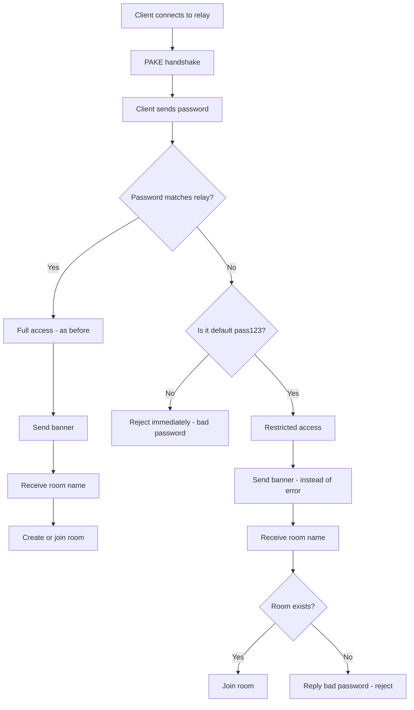

# Plan: Two-level relay authorization in croc

## Problem

When sender CS1 runs relay CR with password CRP and sends a file to recipient CR1, the receive command includes `--pass CRP`. Recipient CR1 learns the relay password and can:
- Create new rooms on the relay
- Send files to others through the relay without CS1's permission

## Solution: Modify ONLY the relay

**The client side does NOT change.** All logic is on the relay side.

When the user does not specify `--pass`, the client sends the default password `pass123` (the default value of the `--pass` flag in `src/cli/cli.go`, defined as `models.DEFAULT_PASSPHRASE` in `src/models/constants.go`).



### Backward compatibility

| Scenario | Client password | Relay password | Behavior |
|----------|----------------|----------------|----------|
| Public relay | pass123 | pass123 | ✅ Full access - as before |
| Custom relay, sender | CRP | CRP | ✅ Full access - as before |
| Custom relay, recipient with --pass CRP | CRP | CRP | ✅ Full access - as before |
| Custom relay, recipient without --pass | pass123 | CRP | ✅ Restricted: can join existing room |
| Custom relay, client without --pass | pass123 | CRP | ❌ Cannot create room - bad password |
| Custom relay, client with arbitrary password | garbage | CRP | ❌ Rejected immediately - bad password |
| New relay + old client | any | any | ✅ Works - client unchanged |
| Old relay + new client | pass123 | CRP | ❌ Old relay replies bad password immediately - need to update relay |

## Changes in `src/tcp/tcp.go`

### Function `clientCommunication` — actual code

```go
clientPassword := strings.TrimSpace(string(passwordBytes))
passwordMatch := clientPassword == s.password
isDefaultPassword := clientPassword == models.DEFAULT_PASSPHRASE

// reject immediately if password is neither correct nor default
if !passwordMatch && !isDefaultPassword {
    err = fmt.Errorf("bad password")
    enc, _ := crypt.Encrypt([]byte(err.Error()), strongKeyForEncryption)
    if err = c.Send(enc); err != nil {
        return "", fmt.Errorf("send error: %w", err)
    }
    return
}

// send ok to tell client they are connected
banner := s.banner
if len(banner) == 0 {
    banner = "ok"
}
log.Debugf("sending '%s'", banner)
bSend, err := crypt.Encrypt([]byte(banner+"|||"+c.Connection().RemoteAddr().String()), strongKeyForEncryption)
if err != nil {
    return
}
err = c.Send(bSend)
if err != nil {
    return
}

// wait for client to tell me which room they want
log.Debug("waiting for answer")
enc, err := c.Receive()
if err != nil {
    return
}
roomBytes, err := crypt.Decrypt(enc, strongKeyForEncryption)
if err != nil {
    return
}
room = string(roomBytes)

s.rooms.Lock()
// create the room if it is new
if _, ok := s.rooms.rooms[room]; !ok {
    // restricted access: client with default password cannot create rooms
    if !passwordMatch && isDefaultPassword {
        s.rooms.Unlock()
        log.Debugf("restricted access: cannot create room %s with default password", room)
        err = fmt.Errorf("bad password")
        enc, _ := crypt.Encrypt([]byte(err.Error()), strongKeyForEncryption)
        if err = c.Send(enc); err != nil {
            return "", fmt.Errorf("send error: %w", err)
        }
        return
    }
    s.rooms.rooms[room] = roomInfo{
        first:  c,
        opened: time.Now(),
    }
    s.rooms.Unlock()
    // ... send ok, same as before ...
    return
}
// Room exists — allow joining regardless of password
// ... existing join logic unchanged ...
```

## Files modified

| File | Change |
|------|--------|
| `src/tcp/tcp.go` | Modify `clientCommunication` — allow joining existing room with default password |

## Tests added in `src/tcp/tcp_test.go`

1. `TestDefaultPasswordCanJoinExistingRoom` — default password + existing room → can join ✅
2. `TestDefaultPasswordCannotCreateRoom` — default password + new room → rejected ❌
3. `TestCorrectPasswordFullAccess` — correct password → full access ✅
4. `TestArbitraryWrongPasswordRejected` — arbitrary wrong password → rejected immediately ❌
